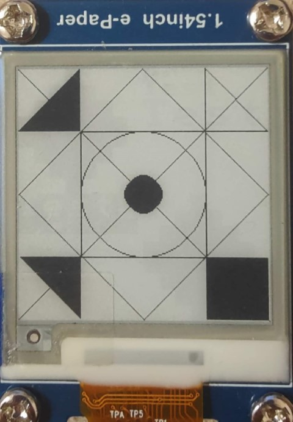

# NAV Projekt
Autor: Jan Tomeček
Zadání: Š - ESP32 či jiný HW: Knihovna pro grafický displej na bázi technologie e-ink

Knihovna byla implementována pomocí ESP-IDF frameworku

Pro generování dokumentace byl využit Doxygen

Info o displeji:
- [Produktová stránka](https://www.waveshare.com/product/displays/e-paper/epaper-3/1.54inch-e-paper-module.htm)
- [Wiki stránka](https://www.waveshare.com/wiki/1.54inch_e-Paper_Module)

## Návrh

Knihovna byla dle zadání navržena modulárně. Odděleny byly i funkce pro komunikaci s modulem, funkce pro základní funkčnost a funkce pro vykreslování grafických prvků.

Knihovna tedy obsahuje tyto části:
- SPI komunikace s modulem
- Základní ovládání displeje
- Grafické funkce

Jednotlivé části budou popsány dále

## Použití knihovny

Knihovnu je potřebné umístit do ./components/ adresáře v ESP-IDF projektu

V Cmake souboru pro zdrojové soubory pak uvézt:

    set(EXTRA_COMPONENT_DIRS ../components/)

A pro ke zdrojovému souboru, který knohovnu využívá uvézt:

    PRIV_REQUIRES eink_xtomec09

Následně stačí jen zahrnout hlavičkový soubor `eink.h` do projektu.

Ukázkový CMakeLists.txt pro projekt využívající knihovnu:

```
#./main/CmakeLists.txt
FILE(GLOB_RECURSE app_sources ${CMAKE_SOURCE_DIR}/main/*.*)

set(EXTRA_COMPONENT_DIRS ../components/)

idf_component_register(SRCS ${app_sources}
                    INCLUDE_DIRS "."
                    PRIV_REQUIRES eink_xtomec09)
```

Pro zapnutí ladících hlášek lze nastavit konstantu DEBUG v eink.h.

## Struktura knihovny
Knihovna se skládá z těchto souborů:
- include/
  - edisplay.h
  - efont.h
  - egraphics.h
  - eink.h
  - espi.h
- edisplay.c - Základní ovládání displeje
- egraphics.c - Grafické funkce
- eink.c - Demo funkce pro demonstraci knihovny
- espi.c - SPI komunikace s modulem

## Demo ukázka
eink.c - void einkD_Demo()

Funkce inicialzuje displej, a vykreslí 2 snímky demonstující:
1. snímek - geometrické funkce
2. snímek - vykreslení bitmapy a textu




## Komunikace přes spi
espi.c, espi.h

Tento modul obsahuje funkce:
- void SPI_Init()
- void SPI_Send_Byte(uint8_t byte)
- void SPI_Finish()

Kód modulu vychází z příkladu ESP-IDF projektu SPI sender.

### void SPI_Init()
SPI_Init()

Funkce pro inicializaci komunikace s displejem.

Pro komunikaci byla požita periferie VSPI na pinech:
- SCLK - 18
- MOSI - 23
- SS - 5

Zařízení komunikují na fekvenci 1MHz.

### void SPI_Send_Byte(uint8_t byte)
SPI_Send_Byte(uint8_t byte)

Funkce implementující zaslání 1 byte přes SPI na Display.

Data jsou posílány pouze po bytech, kvůli odesílání příkazů, které většinou jsou velké 1 byte. Tento návrh také vychází z knihovny od waveshare pro Raspbery pi Jetson, která také data odesílá po bytech.

### void SPI_Finish()
SPI_Finish()

Tato funkce implementuje odebrání zařízení z SPI API (volá spi_bus_remove_device(spi_device_handle_t handle)).

Funkce implementována spíše pro úplnost knihovny.

## Základní ovládání displeje
edisplay.c, edisplay.h

Modul založen na ovladači pro Raspbery pi Jetson od firmy waveshare.
[Repozitář knihovny](https://github.com/waveshare/e-Paper/blob/master/RaspberryPi_JetsonNano/c/lib/e-Paper/EPD_1in54.c)

Soubor edisplay.h obsahuje definici portů pro komunikaci s displayem,
pro změnu portů je nutné upravit tyto konstanty:
- EINK_SCLK_PIN (18)
- EINK_MOSI_PIN (23)
- EINK_CS_PIN (5)
- EINK_BUSY_PIN (13)
- EINK_RST_PIN (12)
- EINK_DC_PIN (14)

Dále zde deklauje tyto typy:
- eink_update_t - enum pro výběr módu displeje
- eink_image_t - typ pro buffer obsahující snímek, který bude zapsán na displej

Modul obsahuje tyto funkce:
- void einkD_Init(eink_update_t updateType)
- void einkD_Refresh()
- void einkD_Clear()
- void einkD_Sleep()
- eink_image_t *einkD_GetImgPointer()

### void einkD_Init(eink_update_t updateType)
einkD_Init(eink_update_t updateType)

Inicializace displeje. Parametr eink_update_t updateType určuje, 
zda bude displej použit v módu Full update, nebo Partial update.

Funkce inicialituje všechny GPIO piny a zavolá SPI_Init().
Následně zašle inicializační příkazy.

### void einkD_Refresh()
einkD_Refresh()

Hlavní funkce pro vykreslení obsahu bufferu snímku na obrazovku. Pracuje s eink_image_t buffere, který je deklarovaný globálně v modulu (static eink_image_t image).

Pro získání ukazatele na buffer snímku lze použít funkci einkD_GetImgPointer().

Po zavolání funkce odešle obsah bufferu snímku na displej. Následně zašle sekvenci příkazů pro vykreslesní a zavolá funkci einkD_WaitForBusy(), která čeká dokud displej nenastavý busy bit na logickou 0.


### void einkD_Clear()
einkD_Clear()

Vymaže obsah disleje. Funkce nastaví buffer snímku na hodnotu bílé, 
následně zavolá einkD_Refresh().


### void einkD_Sleep()
einkD_Sleep()

Funkce začle na displej sekenci příkazů pro uvedení displeje do režimu hlubokého
spánku.

Pro probuzení displeje je nutné zavolat einkD_Init(eink_update_t updateType).

### eink_image_t *einkD_GetImgPointer()
einkD_GetImgPointer()

Vrátí ukazatel na buffer snímku. (viz eink_image_t v edisplay.h).


## Grafické funkce
egraphics.c, egraphics.h

Modul nejprve definuje konstanty, které rezprezentují barvy displeje:
- EINK_WHITE (1)
- EINK_BLACK (0)

Před použitím tohoto modulu je nutné inicializovat displej pomocí einkD_Init(eink_update_t updateType).

Modul pak obsahuje tyto funkce pro vykreslení základních grafických prvků:
- void einkD_Set_Pixel(int x, int y, uint8_t color)
- void einkD_Draw_Line(int x1, int y1, int x2, int y2, uint8_t color)
- void einkD_Draw_Circle(int xc, int yc, unsigned r, uint8_t color)
- void einkD_Draw_Filled_Circle(int xc, int yc, unsigned r, uint8_t color)
- void eink_Draw_Rectangle(int x1, int y1, int x2, int y2, uint8_t color)
- void eink_Draw_Filled_Rectangle(int x1, int y1, int x2, int y2, uint8_t color)
- void einkD_Draw_Triangle(int ax, int ay, int bx, int by, int cx, int cy, uint8_t color)
- void einkD_Draw_Filled_Triangle(int ax, int ay, int bx, int by, int cx, int cy, uint8_t color)
- void einkD_Draw_Bitmap(uint8_t *bitmap, unsigned mapWidth, unsigned mapHeight, int posX, int posY, unsigned finalWidth, unsigned finalHeight)
- void einkD_Set_Text_Cursor(unsigned x, unsigned y)
- void einkD_Print(char *str, unsigned font_size, uint8_t color)
- void einkD_PrintLn(char *str, unsigned font_size, uint8_t color)

### void einkD_Set_Pixel(int x, int y, uint8_t color)
einkD_Set_Pixel(int x, int y, uint8_t color)

V bufferu snímku nastaví pixel na daných souřadnicích na hodnotu color (EINK_BLACK, nebo EINK_WHITE).

### void einkD_Draw_Line(int x1, int y1, int x2, int y2, uint8_t color)
einkD_Draw_Line(int x1, int y1, int x2, int y2, uint8_t color)

Bresenhamův algoritmus pro rasterizaci úseček.

Funkce byla převzatá a poupravená z [zdoj](https://en.wikipedia.org/wiki/Bresenham%27s_line_algorithm).

### Kružnice
void einkD_Draw_Circle(int xc, int yc, unsigned r, uint8_t color)

void einkD_Draw_Filled_Circle(int xc, int yc, unsigned r, uint8_t color)

Implementace bresenhamova algoritmu pro rasterizaci kružnice. 

Funkce byly převzaty a poupraveny z [zdoj](https://www.geeksforgeeks.org/bresenhams-circle-drawing-algorithm/).

### Obdelník
void einkD_Draw_Rectangle(int x1, int y1, int x2, int y2, uint8_t color)

void einkD_Draw_Filled_Rectangle(int x1, int y1, int x2, int y2, uint8_t color)

Implementace rasterizace obdelníků. Pro nevyplněnou variantu byla použita funkce einkD_Draw_Line(int x1, int y1, int x2, int y2, uint8_t color).

### Trjúhelník
void einkD_Draw_Triangle(int ax, int ay, int bx, int by, int cx, int cy, uint8_t color)

void einkD_Draw_Filled_Triangle(int ax, int ay, int bx, int by, int cx, int cy, uint8_t color)

Rasterizace trojúhelníků. Pro nevyplněnou variantu byla použita funkce einkD_Draw_Line(int x1, int y1, int x2, int y2, uint8_t color).
Pro rasterizaci vyplněného trojúhelníku byl použit algoritmus rasterizace 
s hranovou funkcí.

Rasterizace vyplněného trojúhelníku byla převzata a upravena z [zdroj](https://www.scratchapixel.com/lessons/3d-basic-rendering/rasterization-practical-implementation/rasterization-stage.html)

### Obrázek/Bitmapa
einkD_Draw_Bitmap(uint8_t *bitmap, unsigned mapWidth, unsigned mapHeight, int posX, int posY, unsigned finalWidth, unsigned finalHeight)

Funkce slouží k vykreslení bitmapy do bufferu sníku. Funkce upraví velikost vstupního obrázku podle zadané vísledné velikosti a vykreslí na zadanou pozici.
(pozice určuje polohu levého horního rohu)

### Text
void einkD_Set_Text_Cursor(unsigned x, unsigned y)
void einkD_Print(char *str, unsigned font_size, uint8_t color)
void einkD_PrintLn(char *str, unsigned font_size, uint8_t color)

Pro práci s textem je nutné nastavit pozici kurzoru pomocí einkD_Set_Text_Cursor(unsigned x, unsigned y) (Pozice kurzoru určuje levý horní roh písmen).

Pro výpis textu je možné použít zbývající 2 uvedené funkce - einkD_Print a einkD_PrintLn.

einkD_Print(char *str, unsigned font_size, uint8_t color) vypíše text (parametr char *str) do bufferu snímku. Text vypisuje zadanou velikostí (parametr unsigned font_size), které může být od 8 do 36, a zadanou barvou (EINK_BLACK, nebo EINK_WHITE). Pokud by se text nevešel na řádek, rozdělí ho a zalomí řádek (neřesí gramatickou správnost zalomení).

einkD_PrintLn navíc nastaví po vypsání textu kurzor na nový řádek. Volá einkD_Print.

Font textu je definován v efont.h, je převzat a poupraven z [zdroj](https://github.com/dhepper/font8x8/blob/master/font8x8_basic.h)